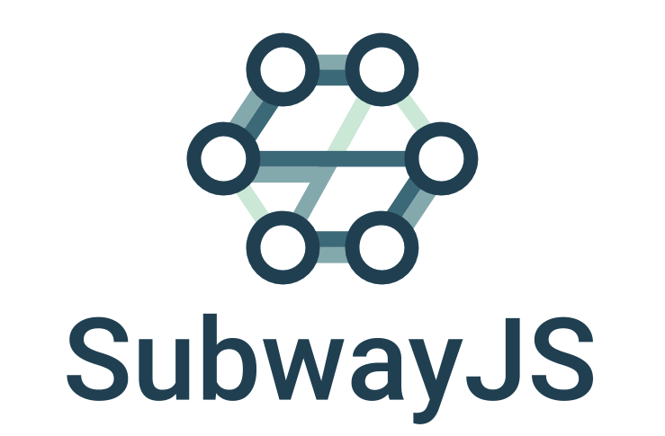

<p align="center">
  
</p>
<br>
<br>

[](https://github.com/subway-js/subway/actions?query=workflow%3A%22Build+%26+Unit+Tests%22) [](https://codecov.io/gh/subway-js/subway) [](https://github.com/subway-js/subway/blob/master/LICENSE) [](https://badge.fury.io/js/%40subway-js%2Fsubway)  

## Subway JS

SubwayJS explores the idea of bringing to the browser some of the patterns and benefits of **Domain Driven Design, Event Sourcing and CQRS** - for frontends and micro-frontends development.


## Motivation

Subway JS is a personal project/experiment from [danilorossi](https://github.com/danilorossi).

I experienced first-hand the **benefits** of applying DDD, Event Sourcing and CQRS patterns in the development of distributed systems:

- as a **software engineer**: elegant and reactive architectures that decouple large domains into smaller ones, enabling more loosely coupled units and independent development and deployments - plus, a business logic based on messaging that is highly descriptive of the specific domain
- as an **engineering manager**: not only a way to structure engineering departments with independent and cross-functional teams, but also a way to shape an organisation at all levels facilitating the adoption of a DevOPs culture - providing at the same time a shared vocabulary that facilitates communications and operations

Working in such contexts - as a frontend engineer and then as a manager - I missed the same principles, and benefits, applied as a standard on the client side of the stack.

Subway JS  **aims to fill this gap**, taking inspiration from:

- **Domain Driven Design**: Subway promotes a software design that identifies clear sub-systems and boundaries, which not only leads to a more self-explaining codebase structure, it also helps shaping your development team structure, and prepares you for an easy transition to a micro-frontends model
- **Event Sourcing & CQRS**: Subway provides a *commands & events* way to describe a system behaviour that's easy to understand and to talk about. It also promotes the decoupling of each sub-system, which makes it easy to switch implementations and add new features


## Build status

Build status of continus integration i.e. travis, appveyor etc. Ex. - 

[](https://travis-ci.org/akashnimare/foco)
[](https://ci.appveyor.com/project/akashnimare/foco/branch/master)

## Code style

If you're using any code style like xo, standard etc. That will help others while contributing to your project. Ex. -

[](https://github.com/feross/standard)

## Tech/framework used

Ex. -

<b>Built with</b>

- [Electron](https://electron.atom.io)

## Features

Subway JS provides **guidelines** about:

- how to logically and phisically structure your code
- how to shape your business logic using a commands/events pattern

and a set of **features** that facilitate:

- commands/events messaging
- observable stores creation and updates
- micro-frontends bootstrapping
- cross micro-frontends UI components sharing system


## Code Example

Show what the library does as concisely as possible, developers should be able to figure out **how** your project solves their problem by looking at the code example. Make sure the API you are showing off is obvious, and that your code is short and concise.

```javascript
// Create your domain : src/domains/tab
const tabDomain = Subway.domain('tab');

const { engine, view } = tabDomain;
  
const { commandBus, eventQueue, stores } = engine;
const { onCommand, onEvent, createStore, publishComponent } = engine;

commandBus.on
eventQueue.on
stores.create

const { broker, stores } = view;
const { pushCommand, spy, observeStore, importComponent } = view;

broker.pushCommand
broker.spy
stores.observe
```


```javascript
const authDomain = Subway.domain('auth');

const { engine } = authDomain;
const { commandBus, eventLog, stores } = engine;

const sessionStore = stores.create('session', {
  active: false,
  username: null,
  token: null,
});

// authErrorsStore ??

commandBus.on('authenticate', () => {
  return event('userSuccessfullyAuthenticated')
  return event('userAuthenticationFailed')
})

commandBus.on('logoutUser', () => {
  return event('userLoggedOut')
})

sessionStore.on('userSuccesfullyAuthenticated', () => {
  active: true,
  username,
  token,
})

sessionStore.on('userLoggedOut', () => {
  active: false,
  username: null,
  token: null,
})


uiLib.publish('LoginModal', onMount, onDismount);
  


```


```javascript
// Create your domain
const tabDomain = Subway.domain('tab');

// Get a reference to Subway helpers
const { commands, events, stores } = tabDomain;

// Create a store for your domain
const tables = stores.create('tables', {
		1: { tableId: 1, opened: false },
		2: { tableId: 2, opened: false },
});

// Declare how an event changes the store
tables.updateOnEvent('tabOpened', (message, currentStore) => {
	...currentStore,
	[message.tableId]: { opened: true, size: message.peopleNumber }
}); 
 
// Setup command handlers
commands.observe('openTab', ({ tableId, peopleNumber }, { store, event, reject }) => {
  if(store[tableId].opened) {
    // tab already open
		return reject('Tab already opened for table ' + message.tableId);
  } else {
    // tab available
    return event('tabOpened', { tableId, peopleNumber });
  } 
});

// In the UI...
const tabDomain = Subway.domain('tab');
const { view } = tabDomain;

// Listen to store change and update the view
view.stores.observe('tables', nextState => {
  // Update the UI...
});

// Spy messages to update UI e.g. loading status
view.broker.spy([
  { on: 'openTab', do: () => setLoading(true) }
  { on: ['openTab@Rejected', 'tabOpened'], do: () => setLoading(false) }
])

// Trigger business logic by pushing a command
view.broker.pushCommand


('openTab', { 
  tableId: 1, 
  peopleNumber: 2 
});
```


## Installation

Provide step by step series of examples and explanations about how to get a development env running.

## API Reference

Depending on the size of the project, if it is small and simple enough the reference docs can be added to the README. For medium size to larger projects it is important to at least provide a link to where the API reference docs live.

## Tests

Describe and show how to run the tests with code examples.

## How to use?

If people like your project they’ll want to learn how they can use it. To do so include step by step guide to use your project.

## Contribute

Let people know how they can contribute into your project. A [contributing guideline](https://github.com/zulip/zulip-electron/blob/master/CONTRIBUTING.md) will be a big plus.

## Credits

Give proper credits. This could be a link to any repo which inspired you to build this project, any blogposts or links to people who contrbuted in this project. 

#### Anything else that seems useful

## License

A short snippet describing the license (MIT, Apache etc)

MIT © [Danilo Rossi](https://github.com/danilorossi)

