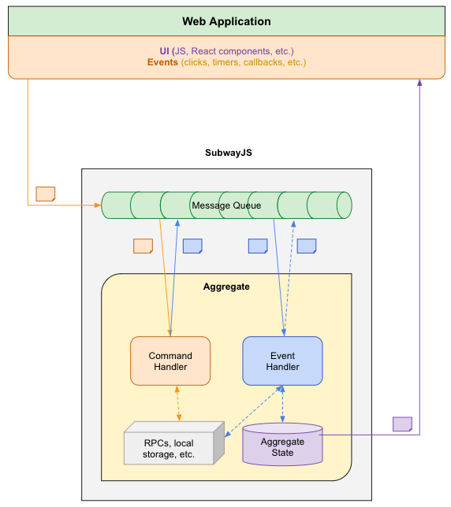
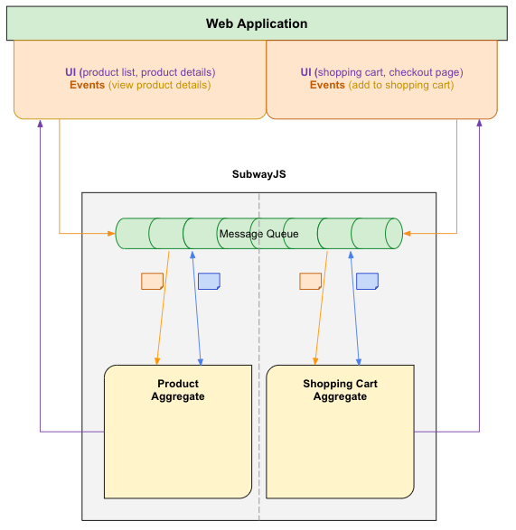
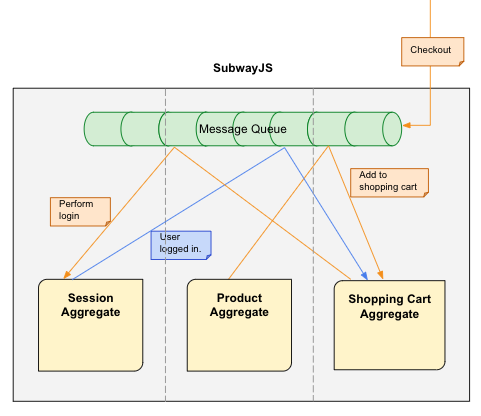
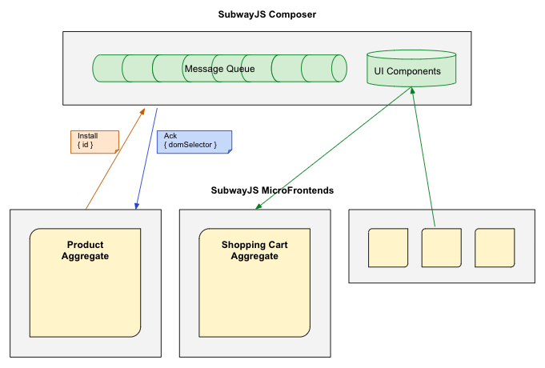

# Understanding SubwayJS

Content of this section:
- Concepts
- Microfrontends
- SubwayJS diagrams


## Concepts
---

```
1. TODO: clarify app design approach - identify domains/aggregates of the system e.g. use [ecommerce react website](https://github.com/subway-js/subway-react-ecommerce) as an example - describe in its README the app design approach

2. TODO: provide context and differences e.g. MVC, SAM, React, Redux, Sagas etc.
```

> SubwayJS is about structuring your application, codebase, logic and teams: it doesn't make any assumptions on the UI library you are going to use.


The current state of SubwayJS matches the overall idea of having:

- **aggregates** (or sub-systems, or domains), the main SubwayJS entities, with their own in-memory **store**

- a message broker, where **messages** are sent and dispatched - messages can be one of the following two types:

    - **commands**, proactively sent (e.g. in response to a UI action)

    - **events**, triggered by commands or other events, and represent facts, things that happened in the system - they can change an aggregate's state

- aggregates reacting to messages through commands or events **handlers**

- the ability to **observe** an aggregate's state, in order to be notified when a change happens - and update the UI accordingly

All of this happens in each aggregate's scope, with commands and events that are very specific to each aggregate, and the specific aggregate's state being updated. But, in order to have a working application, we need a way for aggregates to communicate between each other - they do it by:

- **exposing commands handler**, as a way to define a public API for other aggregates (e.g. aggregate Session could expose a command handler for *LOGOUT* or *SHOW_LOGIN_MODAL* commands, and other aggregates could *broadcast* such messages to trigger the logic)
- **exposing events**, as a way to communicate to other aggregates who can subscribe to such events e.g. a ShoppingCart UI container in a Payment aggregate could subscribe to the **USER_LOGGED_IN** event to know when to show a *proceed to checkout* button)

Features under investigation:

- the ability to **spy** on any message going through the message queue bus

- the ability to **expose components** to other aggregates e.g. the Payment aggregate could have a ShoppingCart view, and could expose a shopping cart dropdown button to be used in the navigation bar - to show the actual list of items and a checkout button)

## Micro-frontends
---

Having highly decoupled aggregates (each of them with its own logic, entities, state and UI), makes it easy to transition to a micro-frontends approach.

SubwayJS provides a **micro-frontends orchestration utility** (implemented with the same SubwayJS library through aggregates, commands and events) to make it easy to split each aggregate (or domain, or sub-system) into its own project/codebase with its own release pipeline.

Check [subway-react-ecommerce-microfrontends](https://github.com/subway-js/subway-react-ecommerce-microfrontends) for updates.


## SubwayJS diagrams
---


### 1. Basic SubwayJS application



We could imagine a very basic SubwayJS application to be made up by only one aggregate.

**Aggregate**

Let's describe the diagram above by starting with the **aggregate** one. 

An aggregate can connect to the message queue in order to:

- *receive and handle* **commands** (in yellow)
- *receive, send and handle* **events** (in blue)

Both command and event handlers can trigger additional events.

An aggregate can have a **state**, which can only be updated by an EVENT handler: commands can't change the aggregate's state, events can as they describe a change in the system state.

Command handlers can perform RPC calls or whatever is needed before trigger any event, and can also reject a command.

Event handlers can also perform RPC calls to perform their duties.

Every time an event handler changes the aggregate states, the UI that subscribes to that, will be **notified with the new state**.

There is no way to create a command from inside ANY handler: **commands are a result of a UI interaction** (with the user or in a callback e.g. after a response or a timer) - it's like taking an intent of an action and translating it into a command that is relevant in the context of our domain.


### 2. SubwayJS application design



SubwayJS benefits are related to breaking down our application domain logic into aggregates (or sub-domains).


The vertical grey line that separates the aggregates express the fact that each aggregate should be totally decoupled from the others. Each aggregate should contain:

- the view and/or UI components
- the business logic for the specific sub-domain: each aggregate defines the verbs (commands and events) that are relevant in its specific domain, and the handlers to implement the business logic - such messages are often described as domain events
- the required API calls
- the aggregate relevant state

specific and related to the part of the domain this aggregate is taking care of.

> Aggregates should be mapping the project folders structure, so that there is a clear separation of the code. 

> From aggregate A, which lives inside `src/aggregates/a` we should NEVER call directly any API on aggregate B (e.g. by doing `SubwayJS.selectAggregate('B`)...`: this is an anti-pattern in SubwayJS. 

> We shouldn't observe aggregate B state from any other aggregate:  this is an anti-pattern in SubwayJS. 

> At no time aggregate A should also rely on domain events from aggregate B as they are considered to be internal to the aggregate (we will talk more about this in the next section).

Take a look at the projects section to see how aggregates are defined in each project

> TODO: section to explain SubwayJS approach at splitting domain logic into aggregates


### 3. Communication between aggregates



If each aggregate is indepentend, how can we implement an application where components need to communicate between each other?

In SubwayJS an aggregate can:

- expose a command handler (and broadcast a command)
- broadcast an event (and listen to external events)

This way we create an API for each aggregate as a way to differenciate:

- events and commands that are relevant for the aggregate itself
- events that are used to notify the rest of the world
- things that an aggregate is able to do for the rest of the world

The above diagram is an example of the [ecommerce react website](https://github.com/subway-js/subway-react-ecommerce) application logic:

- from the product details page the user clicks on 'Add to shopping cart' button (not visible in the diagram): that will create a command that will be sent to the message queue and will be handled by the Product Aggregate. As a result, it will broadcast a command to the Shopping Cart Aggregate and forget about the rest: Shopping Cart Aggregate is the one who knows how to handle this (e.g. update the navigation shopping cart dropdown list, keep the total amount, etc.)

- the user decides to checkout and pay, so a command is triggered and handled by the relevant aggregate, the Shopping Cart one, which is the one in charge of that flow. In order to proceed, we need the user to be logged in, so we request that by broadcasting the PerformLogin command, which Session Aggregate knows how to handle (e.g. will show a modal, perform authentication, etc.)

- once the authentication is performed, an event will be emitted to the 'world': the user is authenticated (with the username and additiona data). The shopping cart aggregate is subscribed to such event, and will proceed accordingly. This step shows that we do not access the state of another aggregate: we subscribe to public events that carry the relevant data (in this case it may be the username and the JWT token).


### 4. Microfrontends and shared UI components



This way of designing apps facilitates the transition to microfrontend. In this diagram, each grey box is a codebased, independently deployed (which is, a JS file imported on an HTML page).

There is a 'master' app which define which microfrontend goes where on the page, and then all other microfrontends install themselves: once everyone is ready, each microfrontend will be notified, passing the target dom element selector where it should initialize itself.

Aggregates code should be independent and decoupled, isolated in its specific folder, so only minor refactoring is required (e.g. imports etc.)

In the case of the [ecommerce react website](https://github.com/subway-js/subway-react-ecommerce) , the shopping cart aggregate was exporting a dropdown list used in the navigation bar, but now we can't directly import it as we are in different codebases: SubwayJS provides the ability of exporting UI components so that they can be requested at runtime by other aggregates (check the [ecommerce react website](https://github.com/subway-js/subway-react-ecommerce) as an example).

A microfrontend might contain multiple aggregates, it depends on the needs of each specific application, and not all aggregates might need to be mounted on a specific dom element. Some of them might just publish reusable UI components, others might provide some logic or service (e.g. logging).